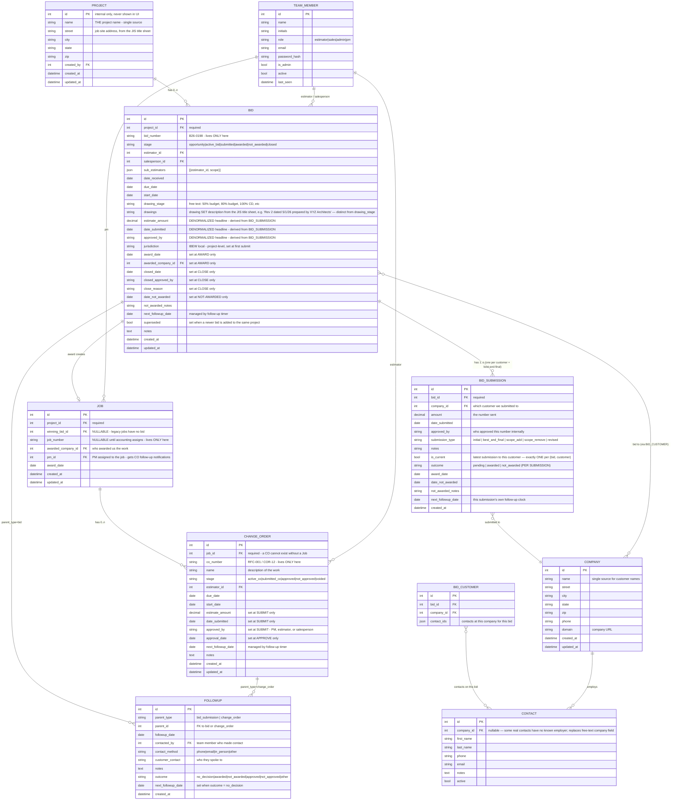
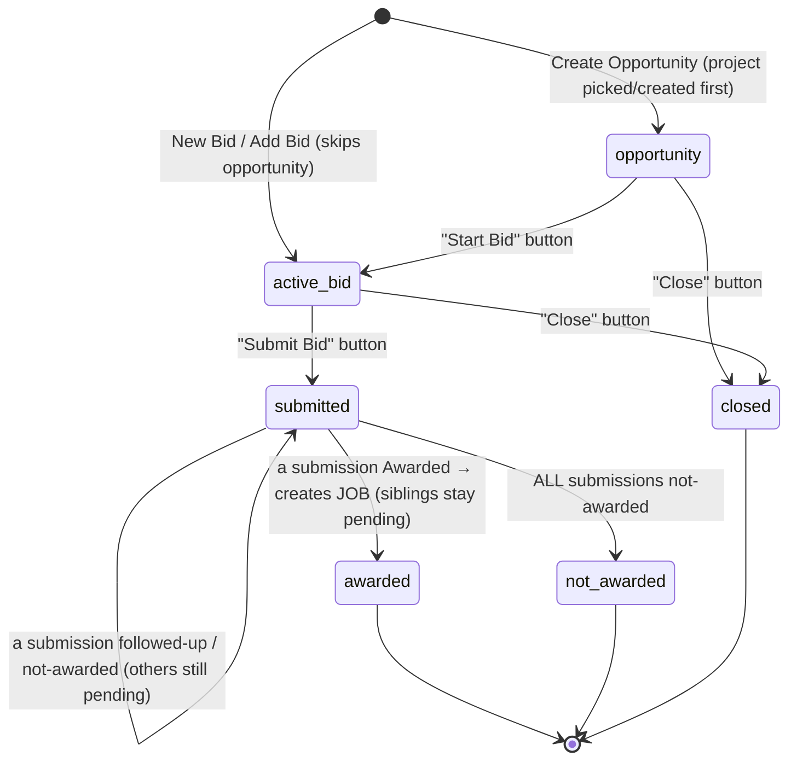
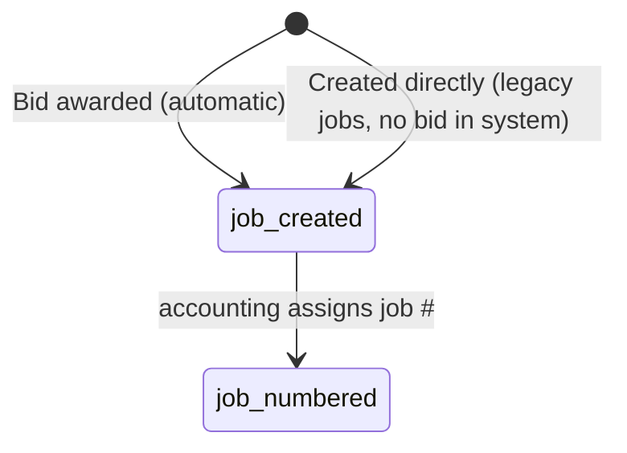
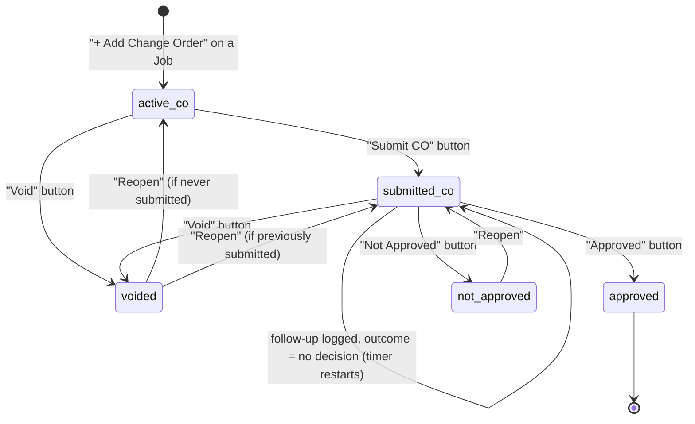

# LIS Estimating Calendar v2 — Gold-Standard Data Model Specification

**Status:** DRAFT v2 — open questions resolved June 12, 2026 (see §7); awaiting full-team sign-off
**Author:** Joe Monchek + Claude
**Date:** June 12, 2026
**Purpose:** Define the correct database structure and application workflow before any further development. Once approved by the team, this document is the single source of truth. Implementation either migrates the current app to this model or rebuilds fresh against it — but the model itself does not change without re-approval here.

---

## 0. Design Principles

1. **Every datapoint lives in exactly ONE place.** No field is ever stored on two entities. (The current system stores job # on Bids, Projects, *and* CO-bids — this is the root cause of the linking mess.)
2. **Entities are separated by what they ARE, not by what screen shows them.** Bids and Change Orders are different things with different lifecycles — they get different tables.
3. **Fields appear only when the lifecycle says they exist.** An active bid has no job #, no estimate $, no award date — those fields literally cannot be filled in until the stage that creates them.
4. **All relationships use internal IDs (foreign keys), never strings.** Linking by matching text (job number strings, customer names) is forbidden.
5. **State transitions are controlled.** Stage changes only happen through explicit action buttons that collect the required fields for that transition (the state machine pattern already proven in the current app).

---

## 1. Entity Relationship Diagram

**Supporting entities carried over unchanged:** `Settings` (global follow-up timers), `Counter` (ID sequences), `Idea` (ideas/issues inbox), `IgnoredPair` (duplicate review), session store.

**Reminders:** become a small polymorphic entity like Followup (`parent_type` + `parent_id`) instead of a sub-document array on Bid, so reminders can attach to Bids, Jobs, or COs.

### Field-Placement Rules (the one-place-only table)

| Datapoint | Lives ONLY on | Everyone else gets it via |
|---|---|---|
| Project name | `Project.name` | join through `project_id` |
| Bid # (B26-XXXX) | `Bid.bid_number` | — |
| Job # | `Job.job_number` | join through `job_id` / `winning_bid_id` |
| RFC/CO # | `ChangeOrder.co_number` | — |
| Customer name | `Company.name` | join through `BID_CUSTOMER` / `awarded_company_id` |
| Contact info | `Contact` | join through `company_id` / `contact_ids` |
| Estimate $ | `Bid.estimate_amount` / `ChangeOrder.estimate_amount` | — |
| Follow-up timers | `Settings` | global config |

> **There is no "bid name."** The bid displays its project's name. The current `Bid.project_name` field (confusingly the "Bid Name") is eliminated. Where the current system used bid-name prefixes like "RFC-20 Bulletin 16 — Fire Alarm", that information now lives properly on `ChangeOrder.co_number` + `ChangeOrder.name`.

---

## 2. State Machines

### 2.1 Bid Lifecycle

> **Win/loss and follow-ups are tracked PER SUBMISSION**, not per bid (see §2.1a). The bid's stage is a rollup of its submissions' outcomes.

**Two ways a Bid is born:** (a) as an `opportunity` first, then promoted via Start Bid; or (b) **created directly at `active_bid`**, skipping the opportunity stage — for when we already know we're bidding. Both paths require the same Start Bid inputs and both assign the bid #. Direct creation is used for a brand-new project, an existing project (a re-bid at a new drawing stage), or any time the internal-discussion opportunity step isn't needed.

| Transition | Button | Required inputs | System actions |
|---|---|---|---|
| → `opportunity` | Create Opportunity | Project (pick existing or create new — see below) | Bid created with FK to project. Most opportunities immediately advance, but some stay here for internal discussion and never become bids. |
| → `active_bid` (direct) | **+ New Bid** (choose new vs existing project) or **+ Add Bid to Project** | Project (new or existing) + all Start Bid inputs below (including the manually-entered bid #) | Creates the bid straight at `active_bid` with the entered bid # — bypasses the opportunity stage. The "+ Add Bid to Project" button on a project is how each drawing-stage re-bid (50% budget → 70% → 100% CD) gets its own B#### under the same project. **Adding a bid to a project supersedes the project's prior non-terminal bids** (see Superseding below). |
| `opportunity` → `active_bid` | Start Bid | **Bid # (entered manually)**, customer company(ies), customer contact(s), estimator, salesperson, date received, due date. Optional: sub-estimators with scope (data, fire alarm, lighting, lighting controls, etc.), start date, drawing stage (free text: "50% budget", "80% budget", "100% CD"…) | **Bid # is typed in for now** (generated outside this system); auto-generation is a future goal. **Bid #s exist only from this point — opportunities have no bid #.** |
| `active_bid`/`submitted` (stays) | **+ Customer** | One or more customers (pick existing or type a new name) | Adds rows to the bid's **BidCustomer** roster — **independent of any submission** (`addBidCustomers`). Idempotent (already-listed customers are skipped). New names are found-or-created as Company records (`resolveCompanyByName`, case/punctuation-insensitive). This is how you build out who a bid went to before any number is sent, or add a customer later. |
| `active_bid` → `submitted` | Submit Bid | **Customer** (one of the bid's customers), amount $, IBEW jurisdiction, date estimate sent, approved by | Creates the **first BidSubmission** (`submission_type = initial`). Follow-up timer starts: `next_followup_date = date_submitted + Settings.fu_initial_days`. Salesperson notified. The customer picker auto-adds to the roster if needed (`ensureBidCustomer` is now create-if-missing). |
| `active_bid`/`submitted` (stays, or → `submitted`) | + Add Submission | Customer, type (`best_and_final`/`scope_add`/`scope_remove`/`initial` to another customer/`revised`), amount $, date, approved by, notes | Creates another **BidSubmission**. Prior current submission to the *same customer* flips `is_current = 0`. Follow-up timer resets. Covers (a) submitting to additional customers under one bid #, (b) best-and-final / add-or-remove with no new drawings, and (c) logging a revision on a bid that's back at `active_bid` via Reactivate (see below) — same "flip to `submitted` once every customer is covered" check as Submit Bid. |
| `submitted`/`closed` → `active_bid` (or `opportunity` if `closed` with no bid # yet) | ↻ Reactivate | New due date (required unless reactivating a `closed` bid straight to `opportunity`) | **Does not touch existing BidSubmissions** — they stay as history, `is_current` flags untouched. Use **+ Add Submission** (now available from `active_bid` too, not just `submitted`) to log the revised numbers once ready; **Submit Bid** only covers customers who don't already have a current submission. |

**Submit Bid vs. + Add Submission — one button, not two:** which one shows is not a function of stage, it's `bidNeedsFirstSubmission()` (`public/v2.html`) — true if the bid has zero customers yet, or at least one customer with no current submission. That's Submit Bid; once every customer on the roster has a current submission, only + Add Submission shows. This is why it's not simply "active_bid = Submit Bid, submitted = Add Submission": a `submitted` bid that just had a new customer added via + Customer needs Submit Bid again for that one customer, and a reactivated `active_bid` bid where every customer already has a submission from before only needs + Add Submission. Both stages call the same `submitOrAddSubmissionBtn()` helper rather than hardcoding which button per stage.
| `submitted` → `submitted` | Log Follow-up **(on a submission)** | Who was contacted, method, notes | Restarts **that submission's** timer (`+ fu_recurring_days`). Bid's follow-up date = earliest pending submission's. |
| `submitted` → `awarded` | Awarded **(on a submission)** | Award date | The submission's `outcome = awarded`; **bid → awarded**, `awarded_company_id` = that submission's company. **Job created**. **Sibling submissions stay `pending`** (resolved individually). One winner per bid. Award button only offered while bid is `submitted`. |
| (submission) → not awarded | Not Awarded **(on a submission)** | Date notified, feedback notes | That submission's `outcome = not_awarded`. If **all** submissions are now not_awarded (none awarded/pending), **bid → not_awarded**; otherwise the bid stays `submitted`. Works on a pending sibling even after the bid is awarded. |
| `opportunity`/`active_bid` → `closed` | Close | Closure date, approved by, reason | Final state. For opportunities we decided not to bid, or bids we stopped mid-estimate. |

**Fields that DO NOT EXIST on the bid form during `opportunity`/`active_bid`:** job #, estimate $, jurisdiction, date estimate sent, estimate approved by, next follow-up date, bid result, award date, awarded contractor. They are collected by the transition modals, never by the edit form.

**Jobsite walk-through (`walkthrough_date`/`walkthrough_time`/`walkthrough_company_id`/`walkthrough_contact_id`, added 2026-07):** optional, independent of stage/due_date. Deliberately **not** part of the generic Edit Bid form — its own dedicated action (🚶 button in the bid card's actions row, plus an always-visible highlighted box on the card once set) since estimating specifically asked for this to be easy to find, not just another field in a long form. Site contact is a real **Company**/**Contact**, found-or-created the same way as any other company/contact picker (`setWalkthrough` in `v2/db.js`, via its own `POST /api/v2/bids/:id/walkthrough` rather than the generic admin-edit whitelist, which can't do find-or-create) — not free text, and not necessarily one of the bid's actual customers (often a GC's on-site super rather than an office contact already on the bid). Setting or changing the date/time fires an immediate "walk-through scheduled" email (`v2/routes.js` → `notify.notifyWalkthroughSet`) to the bid's estimator, salesperson, and any sub-estimators, including the resolved site contact's name/company/phone (`notify.walkthroughContactInfo`). A separate hourly cron (`server.js`) checks for walk-throughs 24 hours out and sends a reminder — this needs BOTH date and time set (no time = nothing to be "24 hours before" of) and only fires once per scheduled walk-through (`walkthrough_reminder_sent`, reset to `false` whenever the date/time changes so a reschedule gets its own fresh reminder). Because the reminder is time-sensitive, not just date-sensitive, the "24 hours before" check is done in real UTC-vs-Eastern math (`etWallClockToUTCms` in `v2/db.js`) rather than the naive date-string comparisons used everywhere else in this app — the only place that distinction currently matters. Both emails also carry an "Add to Outlook" button (a real timed Outlook Web event, not all-day). Walk-throughs also show on both calendar views (Dashboard's embedded one and the standalone Calendar page), scoped to My View the same way due dates/follow-ups already are — no external calendar sync involved, just this app's own calendar.

**Submission invariant (one current per customer):** within a bid, each customer has **exactly one** `is_current = 1` submission — the most recent offer to that customer. Adding a new submission to a customer flips the prior one to `is_current = 0` **and clears its `next_followup_date`**. Superseded submission rows render greyed/inactive in the UI: no action buttons, no follow-up/overdue line, tagged "superseded" — they are history, not work items. (`recomputeBidFollowup` and the dashboard overdue list only consider `is_current = 1, outcome = pending` submissions.) The maintenance script `v2/heal-current.js` re-establishes this invariant if data ever drifts.

**Superseding (re-bid for a later drawing stage):** when a new bid is added to a project that already has bids, the project's prior **non-terminal** bids (`opportunity`, `active_bid`, `submitted`) are marked **superseded** (`superseded = 1`). Superseded bids are inactive/historical — excluded from active counts and pipeline value, no workflow buttons — but kept on the record. Terminal bids (`awarded`/`not_awarded`/`closed`) are never auto-superseded. An admin can clear the flag via Admin Edit.

**Admin editing (admin view only) — see §3.3:** admins can edit fields on any non-terminal entity (Project, opportunity/active/submitted Bid, Job, active/submitted Change Order) **and on individual submissions** (✏️ per submission row). A submitted bid's editable fields are jurisdiction + the superseded flag; the per-customer $/date/approver/outcome live on each submission.

**Duplicate-safe project picker (Create Opportunity, + New Bid, New Legacy Job):** the project field is a single searchable combobox, not a free-text box or a binary "new vs. existing" chooser. Typing fuzzy-matches against every existing Project name (normalized substring, shared significant word, or small edit-distance — same family of matching as Data Health's duplicate clustering) and surfaces close matches live with a "⚠️ Found similar project(s)" flag; you pick one (sets `project_id`) or explicitly confirm a new name (`project_name`, tagged "new" as a chip). This is the front-line defense against double-entering the same project — Data Health's duplicate merge tool remains the backstop for anything that slips through.

**Removing a customer added by mistake (✕ remove, on each customer row in the bid flyout):** deletes the `BidCustomer` row outright. Blocked with a clear error if that customer already has a `BidSubmission` on this bid, or if they're the awarded company — those represent real activity, not a roster mistake, and silently deleting the row would orphan that history. `DELETE /api/v2/bid-customers/:id` → `removeBidCustomer()`.

**Duplicate bids (Data Health "Duplicate bids" card):** a distinct class of mistake from duplicate projects/companies — the same bid # created twice under one project (e.g. a double-click), which project-merge doesn't touch since it operates one level up. Detected by grouping non-superseded bids by `(project_id, bid_number)`; any group with more than one live bid shows up with a "keep" picker and a delete-the-rest button. Deleting a bid (`DELETE /api/v2/admin/bid/:id` → `deleteBid()`, admin-only) is blocked if it's a terminal stage (`awarded`/`not_awarded`/`closed`) or already has a `BidSubmission` — those represent real activity, not a clean accident. Cascades cleanup of the deleted bid's `BidCustomer` rows and `Reminder`s. **Known related gap, not yet built:** an accidental duplicate bid can cascade into duplicate `Contact` records too, if customers/contacts get added to both copies before the duplicate is noticed (confirmed happening in practice) — Data Health doesn't detect duplicate contacts yet, only duplicate projects/companies/bids.

**Standalone Company creation (Contacts page "+ New Company," alongside "+ New Contact"):** creates a `Company` directly with the same fields the JIS importer captures (street/city/state/zip/phone/domain), for when there's no bid or contact context yet. `POST /api/v2/companies` → `createCompanyV2()`.

**Change Order creation, global entry point ("+ New Change Order" on the Active Change Orders page):** a two-step picker — Project, then which of its Jobs (a project normally has one, but legacy + bid-backed duplicates can leave more than one until merged) — since a Change Order can never exist without a Job (enforced server-side in `createChangeOrder()`, not just a UI nicety). If the chosen project has no Job yet, the picker stops with a clear message rather than silently offering to create one — Jobs come from an award or an explicit Legacy Job, never invented on the fly by the CO form. Falls through to the same per-job "+ Add Change Order" form used from within a project's hierarchy — no duplicated form logic. The project dropdown fetches fresh from `/api/v2/projects` rather than trusting `ALL_PROJECTS` (only populated by visiting the Projects page — empty otherwise, since this button lives on the Change Orders page).

**Form dropdown positioning (all searchable comboboxes — company, project, contact pickers):** `.v2-combo-menu` is `position: fixed` with its coordinates computed in JS from the input's real `getBoundingClientRect()` (`comboRenderMenu`), not plain CSS `position: absolute`. `.v2-modal` has `max-height: 88vh; overflow-y: auto` so it can scroll when a form is tall — but that same `overflow-y: auto` clips any `position: absolute` descendant to the modal's own visible bounds, which squeezed every dropdown in every form modal into whatever space was left (confirmed by measuring both ways in a real browser: absolute was clipped by ~90px in a small test modal, fixed rendered fully). `position: fixed` escapes ancestor overflow clipping as long as no ancestor sets `transform`/`filter`/etc. (none here do), so this is a permanent, structural fix rather than a per-form workaround.

**Bid flyout customer display:** each customer is its own bordered card (company name + a small "✕" icon-button to remove, contacts as chips underneath with a "+ Contact" button) rather than cramped inline text — was two dense unstructured lines per customer with a bare "✕ remove" text link jammed next to the company name.

**Names with apostrophes in `onclick` handlers (`escJs()`):** `esc()` only HTML-escapes (`& < > "`) — it never touches `'`. Anywhere a name is embedded inside a *single-quoted JS string* within an `onclick="..."` attribute (two escaping layers at once), an apostrophe in the name breaks the generated JS at that character, and the click silently does nothing (confirmed: broke the "Set Password" button specifically for Jim O'Driscoll). `escJs(s)` = `esc(s)` + escape `\` and `'` for the inner JS-string layer. Use it instead of `esc()` for any name/string passed as a quoted argument inside an `onclick` handler.

### 2.1a Submission outcome lifecycle (per customer)

Each `BidSubmission` carries its own `outcome` (`pending` → `awarded` | `not_awarded`) and its own `next_followup_date`. A bid with three customers has three independent submissions, each followed up and resolved separately.

- **Award a submission** → that customer gave us the job. The bid becomes `awarded` to that company and a Job is created. **The other submissions are left `pending`** — we don't assume the others declined (per team decision). Only one submission can be awarded per bid (the Award action disappears once the bid is awarded).
- **Not-award a submission** → that customer went elsewhere. The bid only flips to `not_awarded` when **every** submission is not_awarded. A pending sibling can still be marked not-awarded after the bid has been awarded (cleanup).
- **Follow-ups** attach to the submission (`parent_type = 'bid_submission'`). The bid's `next_followup_date` is a rollup = the earliest `next_followup_date` among still-pending submissions, so dashboard/digest "overdue" queries keep working at the bid level.

**Submissions vs. re-bids — the dividing line:**
- **Same drawings, customer wants a different/added/removed number, or best-and-final** → a **new BidSubmission** on the same bid (via + Add Submission). The prior submission to that customer becomes non-current but stays on the record.
- **New drawing stage (50% → 70% → 100% CD)** → a **new Bid** under the same Project (re-bid; supersedes the prior bid).

**Bid headline value:** the Bid's `estimate_amount` / `date_submitted` / `approved_by` are **denormalized** from BidSubmission — they show the most-recent current submission while bidding, and switch to the **awarded company's** submission once awarded. Source of truth is the BidSubmission collection; the headline keeps list/pipeline queries simple (one representative number per bid, not a sum across customers).

**Admin editing:** submission $/date/approver are corrected on the **bid_submission** entity (the ✏️ on each submission row); editing one re-derives the bid's headline. See §3.3.

### 2.2 Job Lifecycle

- A Job is born when a bid is awarded — **or created manually at any time** for legacy work bid before this system existed. Manual Job creation is a permanent feature, not a migration-only tool, so legacy jobs can be added after launch as they come up. Legacy jobs have `winning_bid_id = null`.
- `job_number` is **nullable by design**: accounting assigns it after the contract arrives, sometimes days or weeks after award. The UI shows "Job # pending" until set.
- **`pm_id`** — the PM assigned to the job. Set at/after award (or at manual creation). The Job's PM receives CO follow-up notifications (§2.3).
- Change orders attach to Jobs regardless of whether a job # exists yet (they FK to `job_id`, the internal ID, not the number).

### 2.3 Change Order Lifecycle

| Transition | Button | Required inputs | System actions |
|---|---|---|---|
| → `active_co` | + Add Change Order (from Job view) | RFC/CO #, name (description of work), due date, start date. Optional: estimator | Cannot be created without a parent Job. |
| `active_co` → `submitted_co` | Submit CO | Estimate amount $, date submitted, approved by (free pick — can be a PM, estimator, or salesperson) | Follow-up timer starts; **the Job's PM** (`Job.pm_id`) notified (email + webapp). |
| `submitted_co` → `submitted_co` | Log Follow-up (no decision) | Who contacted, method, notes | Timer restarts per Settings. |
| `submitted_co` → `approved` | Approved | Approval date (autofilled today, editable) | CO joins the Job's approved-CO list. |
| `submitted_co` → `not_approved` | Not Approved | Date notified, notes (optional) | Reopenable (below). |
| any active state → `voided` | Void | Reason | **Any user** can void. Customer canceled the RFC / work not proceeding. |
| `voided`/`not_approved` → reopen | Reopen | — | **Any user** can reopen. Returns to `submitted_co` if it had been submitted, otherwise `active_co`. Follow-up timer restarts on reopen to `submitted_co`. |

**Terminology note:** RFC (request for change), COR (change order request), and CO (change order) are all the same entity. The `co_number` field stores whatever prefix the customer's system uses (RFC-20, COR-3, CO-7).

---

## 3. Field Inventory per Entity and Stage

### 3.1 Bid — field availability by stage

| Field | opportunity | active_bid | submitted | awarded | not_awarded | closed |
|---|---|---|---|---|---|---|
| project_id | ●R | ●R | ● | ● | ● | ● |
| bid_number | — | ●R manual | ● | ● | ● | ● |
| customers (companies) | ○ | ●R | ● | ● | ● | ● |
| customer contacts | ○ | ●R | ● | ● | ● | ● |
| estimator_id | ○ | ●R | ● | ● | ● | ● |
| sub_estimators | — | ○ | ○ | ○ | ○ | ○ |
| salesperson_id | ○ | ●R | ● | ● | ● | ● |
| date_received | ○ | ●R | ● | ● | ● | ● |
| due_date | ○ | ●R | ● | ● | ● | ● |
| start_date | — | ○ | ○ | ○ | ○ | ○ |
| drawing_stage | — | ○ | ○ | ○ | ○ | ○ |
| notes | ○ | ○ | ○ | ○ | ○ | ○ |
| estimate_amount | ✕ | ✕ | ● derived from BidSubmission | ● | ● | ✕ |
| date_submitted | ✕ | ✕ | ● derived from BidSubmission | ● | ● | ✕ |
| approved_by | ✕ | ✕ | ● derived from BidSubmission | ● | ● | ✕ |
| jurisdiction | ✕ | ✕ | ●R (set at first submit; admin-editable) | ● | ● | ✕ |
| BidSubmission rows | ✕ | ✕ | ●R (≥1; one per customer + best-and-final) | ● | ● | ✕ |
| next_followup_date | ✕ | ✕ | ● system-managed | ✕ | ✕ | ✕ |
| superseded | ✕ | ● auto/admin | ● auto/admin | ✕ | ✕ | ✕ |
| award_date | ✕ | ✕ | ✕ | ●R (set at award) | ✕ | ✕ |
| awarded_company_id | ✕ | ✕ | ✕ | ●R (set at award) | ✕ | ✕ |
| date_not_awarded / notes | ✕ | ✕ | ✕ | ✕ | ●R | ✕ |
| closed_date / approved_by / reason | ✕ | ✕ | ✕ | ✕ | ✕ | ●R |

Legend: **●R** required · **●** present (read-only or editable per role) · **○** optional · **—** not yet collected · **✕** must not exist/display at this stage

### 3.2 Change Order — field availability by stage

| Field | active_co | submitted_co | approved | not_approved | voided |
|---|---|---|---|---|---|
| job_id | ●R | ● | ● | ● | ● |
| co_number | ●R | ● | ● | ● | ● |
| name (work description) | ●R | ● | ● | ● | ● |
| due_date | ●R | ● | ● | ● | ● |
| start_date | ●R | ● | ● | ● | ● |
| estimator_id | ○ | ○ | ○ | ○ | ○ |
| estimate_amount | ✕ | ●R (set at submit) | ● | ● | ✕ |
| date_submitted | ✕ | ●R (set at submit) | ● | ● | ✕ |
| approved_by | ✕ | ●R (set at submit) | ● | ● | ✕ |
| next_followup_date | ✕ | ● system-managed | ✕ | ✕ | ✕ |
| approval_date | ✕ | ✕ | ●R | ✕ | ✕ |

### 3.3 Admin editing (admin view only)

Admins can correct fields on any **non-terminal** entity through an "Edit" action available only to admins (enforced by the logged-in user's `is_admin` flag on a single endpoint: `PATCH /api/v2/admin/:entity/:id`). Workflow buttons (transitions, follow-ups, Set Job #, Assign PM) remain available to all users — admin Edit is an additional correction/override path, not a replacement.

| Entity | Where admin Edit appears | Fields admins may edit |
|---|---|---|
| Project | every project | name |
| Bid — opportunity | opportunity bids | notes |
| Bid — active_bid | active bids | bid #, estimator, salesperson, dates, drawing stage, notes |
| Bid — submitted | submitted bids | the active-bid fields **plus** jurisdiction and the **superseded** flag (the per-customer $/date/approver live on submissions) |
| BidSubmission | each submission row (✏️) | amount, date submitted, approved by, type, is_current, notes — editing re-derives the bid headline |
| Job | every job | job #, PM, awarded company, award date |
| Change Order — active_co | active COs | co #, name, dates, estimator, notes |
| Change Order — submitted_co | submitted COs | the active-co fields **plus** estimate $, date submitted, approved by |

**Admin Edit never changes `stage`.** Stage transitions always go through the state machine (§2). Terminal entities (awarded/not_awarded/closed bids; approved/not_approved/voided COs) are not editable here — they are historical.

---

## 4. Cross-Comparison: Current State vs Target

### 4.1 Structural breaks (cannot be patched in place)

| # | Current state | Problem | Target |
|---|---|---|---|
| 1 | `job_number` exists on **Bid**, **Project**, and CO-bids | Same datapoint in 3 places; linking requires string-matching; cleanup tools exist solely to reconcile them | Job # lives ONLY on the new `Job` entity |
| 2 | **Change orders are rows in the `bids` collection** (flagged by `stage='active_co'` and/or `co_number`) | COs inherit 40+ bid fields that don't apply; frontend needs `isCO` heuristics everywhere (this caused 3 bugs in the last week alone) | Separate `ChangeOrder` collection with FK to Job |
| 3 | Customers are **free-text strings ×5** (`customer`, `customer2`…`customer5`) | Typos create phantom companies; analytics by customer are fuzzy; the 527-bid missing-customer cleanup problem is a direct symptom | `Company` entity + `BID_CUSTOMER` join table |
| 4 | `Bid.project_name` ("Bid Name") is a **copy** of project info | Two names for the same thing drift apart; required-field validation on it has broken saves repeatedly | Eliminated — bid displays `Project.name` via join |
| 5 | `Contact.company` is free text | Cannot reliably link contacts to the companies we bid to | `Contact.company_id` FK to Company |
| 6 | `stage` + `status` are **redundant** (`status:'Awarded'` duplicates `stage:'awarded'`) | Two fields must be kept in sync manually; the "null stage" bug came from exactly this class of problem | Single `stage` field; `status` eliminated |
| 7 | No `submitted` stage — current `follow_up` stage conflates "submitted, awaiting decision" with the follow-up activity | Awkward stage naming; submission data (`date_estimate_sent`) can exist on non-submitted bids | Explicit `submitted` stage entered only via Submit button |
| 8 | `phases` sub-document on Bid (50% Budget, 80% DD, CD Pricing…) | Phases are snapshots of bid fields — more duplicated data | **Resolved (Q4):** each pricing round is a separate Bid under the same Project, with a `drawing_stage` free-text field ("50% budget", "80% budget", "100% CD"…). Post-submission customer tweaks (no new drawings) are a new **BidSubmission** on the same bid |
| 11 | Single submission per bid (flat `estimate_amount`/`date_submitted`/`approved_by` + `revisions[]`) | Can't represent multiple customers under one bid #, or per-customer best-and-final | **BidSubmission** entity: one row per (bid, customer) submission event; bid headline is denormalized from it |
| 9 | `reminders` sub-document array on Bid | Can't attach reminders to Jobs or COs | Polymorphic `Reminder` entity |
| 10 | `parent_bid_id` links CO-bids to awarded bids, but `getLinkedCOs` ALSO matches by job_number string | Dual-path linking caused the bid-shows-as-its-own-CO bug | Single FK: `ChangeOrder.job_id` |

### 4.2 Compatible as-is (carry over unchanged)

| Entity / system | Notes |
|---|---|
| `TeamMember` | Auth, roles, is_admin, last_seen presence — all fine. Consider adding `pm` role for CO follow-ups. Gained `ms_oid` (Microsoft Entra object id, nullable/unique-sparse) for SSO — see §5 "Sign in with Microsoft". |
| `Settings` | `fu_initial_days` / `fu_recurring_days` already match the described timer design exactly. |
| `Counter` | ID sequence generator — reused for all new entities. |
| `Idea`, `IgnoredPair` | Unchanged. |
| `Followup` | Current schema is ~90% right (who/method/notes/next-date already exist). Add `parent_type` + rename `bid_id` → `parent_id`; add `outcome` enum. |
| Sessions / bcrypt auth / express-session | Unchanged. |
| Email infrastructure (`mailer.js`, cron digest) | Templates reference bid fields — rework field mapping only. |

### 4.3 Verdict: migrate in place vs rebuild

**Recommendation: rebuild the data layer; port the frontend page-by-page; keep the same stack and repo.**

Reasons:
- Items 1–7 above touch **every query in db.js, every form in index.html, and most of the 6,000-line app.js**. "Migrating in place" would mean changing nearly every file anyway — but while live users depend on it, with bad data feeding back in through the old paths.
- The 2026-only data cutoff means the real-data migration is a **bounded, one-time import script**, not an in-place mutation of the live database. That's far safer.
- A fresh MongoDB database (new collections, same Atlas cluster) + import script + fake-dataset test phase gives a clean cutover with a rollback path (old app keeps running until the new one is approved).
- What does NOT need rebuilding: auth, team, settings, email, presence, ideas, TV kiosk scaffolding, the visual design/CSS, and the state-machine button pattern — all carry over.

Realistically this is a **new version of the app sharing ~40% of its code**, not a patch.

---

## 5. Feature Preservation Inventory

Features built in v1, mapped onto the new model:

| Feature | Carries over? | Notes |
|---|---|---|
| State-machine stage buttons + transition modals | ✅ Pattern reused directly | Extended with Submit/Close/Void modals per §2 |
| Follow-up timers + salesperson notification | ✅ | Now also applies to COs; same Settings values |
| Email notifications (assignment, follow-up, awarded, reminders) | ✅ | Re-point field mappings; awarded email gains winning-company name |
| Weekly digest (web + email, Monday 6AM cron) | ✅ Built | `/#digest` page + `v2/db.js` `getDigest()` + `GET /api/v2/digest`. Sections: pipeline snapshot (bids by stage + a combined active-CO line), upcoming reminders, due dates (7 days, bids + COs), new/submitted this week, awarded/not-awarded this week, by-salesperson (overdue count highlighted), and overdue follow-ups **last** (bids, then a separate CO section) — the explicit "don't bury the good news" ask honored. The Monday 6AM cron in `server.js` now reads v2's `getDigest()` (v1's own digest cron retired to avoid sending two separate emails) through the existing `mailer.emailDigest()` template unchanged. |
| **New:** Reminders (polymorphic bid/change_order tickler, separate from the follow-up timer) | ✅ Built (not in v1's exact form) | v1 had per-bid reminders only; v2's schema (already in place pre-JIS-work) also covers change orders. Full CRUD + a daily 7:05am ET cron (`server.js`) via `v2/notify.js`'s mailer bridge. |
| **New:** Awarded-bid email notification | ✅ Built | v2 had no email integration at all until this work — `v2/notify.js` bridges v2's data model onto v1's existing `mailer.js` templates (which expect v1-shaped fields) via a join, so the templates didn't need touching. Wired into the award-submission route. |
| Standalone Calendar (month grid, due dates + follow-ups, estimator color legend) | ✅ Built | `/#calendar`. Same visual language as v1 (reused `.cal-*` CSS classes unchanged) but pulls from bids AND change orders (v1 only had bids, since COs were folded into the same collection). Day click opens a modal listing that day's items, each opening straight into the existing bid/CO flyout. |
| Settings / Team management | ✅ Built | `/#settings`. Team roster (name/initials/role/email/active) CRUD, follow-up timer (`fu_initial_days`/`fu_recurring_days`), and admin email tools (test email, send-digest-now). Backed by TeamMember — **one shared collection as of the July 2026 id merge** (see below). A team member added here with a temporary password can log in AND be assigned to bids immediately; no second step. |
| **Fixed:** TeamMember id merge — v1 and v2 used to be separate rosters | ✅ Fixed | **Discovery:** v1 and v2 were genuinely separate MongoDB databases (`cc-estimating` vs `estimating_v2_test`) with *independently-assigned* TeamMember ids for the same 14 people (e.g. Connor Winters was v1 id 10, v2 id 2) — confirmed zero ids matched across the two. v2's own copies also had almost no emails populated. This silently broke two things: (1) `current_user.id` (from v1 login) compared against v2's `bid.estimator_id`/`salesperson_id` for "mine only" — since ids collided on *different* people, this could show the wrong person's bids. (2) The v2 reminder-email cron looked up recipients in a v1-id-keyed map using v2 ids as keys — wrong-person or no-email delivery. **Fix:** `v2/merge-team-ids.js` remapped every TeamMember-id reference across v2's collections (Project.created_by, Bid.estimator_id/salesperson_id, Job.pm_id, ChangeOrder.estimator_id — 1,585 documents total) from v2's ids to v1's real ids, via a snapshot-then-targeted-update (not blind find-and-replace-by-value, since several mappings chain into each other — e.g. id 8→1 and id 1→19 — which a naive pass could corrupt). `v2/models.js`'s `TeamMember` now points directly at v1's actual model/collection — one roster, no bridging needed. Verified: zero orphaned ids in any collection after the remap, a known bid's estimator/salesperson resolve correctly, and a full round-trip (create with a password → shows in v2's dropdown → logs in via v1 → cleaned up) all passed. |
| **New:** "Sign in with Microsoft" (Entra ID / OIDC) | ✅ Built | Per `docs/SSO_IMPLEMENTATION_PLAN.md`. `msauth.js` wraps `@azure/msal-node`'s `ConfidentialClientApplication` (server-side auth-code flow); everything no-ops gracefully (button hidden, `/auth/login` redirects with `sso=unavailable`) when the three `AZURE_*` env vars aren't set, so a deploy before they're configured in Render can't crash. Top-level `/auth/login` + `/auth/callback` routes in `server.js` (not under `/api/`, so the API auth middleware doesn't apply — no `PUBLIC_API` change needed); `state` param stored in the session and checked on callback to prevent CSRF. `db.js`'s `loginWithMicrosoft({oid, email, name})` matches by `ms_oid` first (durable — survives an email change), else by `email` + `active:1` (stamping `ms_oid` on first SSO login); **never auto-creates** a TeamMember — an unmatched Microsoft account gets a friendly "ask an admin" message on `/legacy`. Password login is untouched and stays as a fallback. UI lives entirely on v1's login overlay (`public/index.html` + `public/app.js`) since that's where login already lives; v2 needs no changes since it already bounces to `/legacy` to authenticate. |
| Dashboard (calendar, upcoming estimates w/ red-yellow-green, My View toggle) | ✅ | Queries re-pointed |
| Projects page (bid counts, pipeline value, estimator pills) | ✅ improved | Hierarchy view becomes natural: Project → Bids → Job → COs is now the actual data shape, not a heuristic |
| Project panel hierarchy (awarded bold, COs nested) | ✅ improved | No more isCO guessing |
| Bid flyout (details, contacts, reminders, lifecycle, View Project →) | ✅ | Lifecycle section reads Job + ChangeOrders directly |
| Filters (person, "mine only") + sorting on bid/CO list pages | ✅ Built | Client-side toolbar on each list page (`v2.html` filterBarHtml/renderBidListBody/renderCoListBody) — search box, estimator/salesperson dropdown, mine-only toggle, sort-by dropdown (due date / follow-up date / amount / project name). Filter state persists per stage while navigating. |
| Global search | ✅ Built, improved | Sidebar box + Ctrl/Cmd+K (`v2/db.js` getSearchResults, `/api/v2/search`). Unlike v1 (Bid fields only), matches project name, bid #, CO #, job #, and Company name — real entities now, not free text. Results grouped by stage, Bids and Change Orders shown separately. Contact matching deferred until the Contacts UI exists (next). |
| Contact/company profile modals + bid history | ✅ Built, improved | Directory page (`/#contacts` — search, company filter, "no company" toggle), profile modals with win/loss/pipeline stats (`calcBidStats`) and bid history, full CRUD. Contact.company_id is a real FK (v1's was free text), so stats are exact instead of string-matched. Per-customer contacts also manageable right from the bid flyout (link/unlink without leaving it) via `BidCustomer.contact_ids`. **Data source fixed:** the initial import wrongly seeded Contacts from Excel's sparse per-salesperson tabs (146 contacts, ~18 w/ phone) instead of v1's real, actively-maintained Contact collection (665 contacts, 610 w/ phone, 646 w/ email). `v2/import-contacts-from-v1.js` replaced it with the real data, mapping v1's free-text `company` string to a v2 Company entity (find-or-create by normalized name; 57 new companies created). `company_id` is nullable — 247 real contacts genuinely have no known employer in v1. |
| Estimator profiles + stats | ✅ | |
| IBEW jurisdiction picker | ✅ | Moves into the Submit Bid modal (it's a submission-time field) |
| Sub-estimators with scope | ✅ | Unchanged shape |
| Reminders | ✅ reworked | Polymorphic entity per §4.1 item 9 |
| Submit bid modal | ✅ | Becomes THE place estimate $/jurisdiction/sent-date/approved-by are entered |
| Admin password-confirm for destructive actions | ✅ | Pattern reused |
| Online presence (sidebar dot, heartbeat) | ✅ | Unchanged |
| Ideas/issues inbox | ✅ | Unchanged |
| TV kiosk view | ✅ | Queries re-pointed |
| Excel sync (`sync-excel-lib.js`) | ⚠️ Replaced | Becomes the one-time 2026 import script (§6). Ongoing Excel sync is retired — the app IS the system of record in v2. |
| Project auto-grouping / duplicate review | ⚠️ Migration-only | Used during import; not needed at runtime since bids are born with a project FK |
| Data Cleanup page (issue chips, RFC/COR cleanup, customer propagation, job-number scan, bulk link) | ❌ Obsolete by design | These tools exist to reconcile the duplicated datapoints v2 eliminates. The "Awarded No Job #" view survives as a normal filter (jobs awaiting accounting's job #). |
| **New:** Import Bid from JIS (Job Information Sheet) | ✅ Built (not in v1) | "📄 Import Bid (JIS)" button on the Projects page. Uploads the estimating coordinator's filled-out JIS `.xlsx`, reads its "Title Sheet" tab (bid #, due date, drawing set description, job name/address, estimator/salesperson, up to 6 GC/customer blocks with company info + point of contact), and matches against existing team members/companies/contacts. Preview-then-confirm — nothing is written until reviewed. If the bid # already exists (the common case — bids are usually already in the system from the Excel sync before the JIS is filled out), it's **enriched** (project address, `Bid.drawings`, GC companies/contacts attached) without touching stage/estimator/salesperson/due_date, which stay owned by the normal workflow. If the bid # doesn't exist yet, a new bid is created (project picked via the same duplicate-safe combobox, estimator/salesperson must be confirmed if not auto-matched). New GC companies/contacts are created with the full detail captured on the title sheet. Backend: `v2/jis.js` (parseTitleSheet/previewJISImport/applyJISImport); routes `POST /api/v2/jis/preview` and `/apply`. Verified end-to-end against a real JIS (B26-0218). |
| Admin stage override | ⚠️ Keep, rarely needed | Still useful for correcting mistakes, but bad-stage data shouldn't occur in v2 |
| Admin-only project rename (✏️ pencil) | ✅ | Confirmed (Q1) — many projects were misnamed in the original Excel; rename stays admin-only |
| Bid "phases" (50% Budget, 80% DD…) | ✅ Replaced | Resolved (Q4): re-bid-under-same-project + `drawing_stage` text field per bid; **BidSubmission** for post-submit customer tweaks / best-and-final |

---

## 6. Data Migration Strategy

### 6.1 Scope filter (per team decision)

Import from the current database ONLY records matching:
- `bid_number` starts with `B26`, **OR**
- any of `start_date` / `date_submitted (date_estimate_sent)` / `due_date (estimate_due_date)` falls in 2026

Everything else stays in the old database (kept read-only for historical reference) — it is NOT deleted, just not migrated. **Future phase (per Q10):** pre-2026 history will eventually be imported in *summarized* form (e.g., per-customer/per-year win-loss totals) for long-term analytics, after v2 is stable.

### 6.2 Derivation rules (old → new)

| Old record shape | Becomes |
|---|---|
| Bid with `stage ∉ {active_co}` and no `co_number` | **Bid** row. Stage mapping: `opportunity→opportunity`, `active_bid→active_bid`, `follow_up→submitted`, `awarded→awarded`, `not_awarded→not_awarded`, `closed→closed` |
| Bid with `stage='active_co'` or `co_number` set | **ChangeOrder** row, attached to the Job matching its job_number string (manual review queue for unmatched) |
| Awarded bid | Bid row + minted **Job** (`winning_bid_id` set, `job_number` from old bid/project, `awarded_company_id` from customer string match) |
| Known legacy jobs (full list, per Q8): AMY James Martin, William H Gray 30th Street Station, Bridesburg Recreation Center, CHOP Fuel Oil, Dillworth Plaza, Friend's Center 3rd Floor Renovations, Temple Infusion, UPenn Vlest Shoji Hall Lab Fitout | **Job** rows created manually with `winning_bid_id = null`. Manual Job creation is a permanent feature — more legacy jobs can be added any time after launch |
| Distinct customer strings across `customer`–`customer5` + `Contact.company` | **Company** rows after normalization (trim, case-fold, collapse punctuation). Fuzzy near-matches (e.g. "Torcon" vs "Torcon Inc.") go to a manual merge-review list — the IgnoredPair review UI pattern is reused for this |
| `Bid.customer`–`customer5` values | **BID_CUSTOMER** join rows pointing at the deduped Company |
| `customer_contacts` sub-docs | Contact links on the matching BID_CUSTOMER row |
| `Followup` rows | Same rows + `parent_type='bid'` |
| `reminders` sub-docs | **Reminder** rows |

Import script properties: **idempotent** (re-runnable), **dry-run mode** (prints what it would create, writes nothing), and emits an **exceptions report** (unmatched COs, ambiguous companies, bids missing required fields) for manual resolution rather than guessing.

### 6.3 Fake dataset for pre-rollout testing

A seed script generates a realistic test database exercising **every lifecycle path** before real data is imported:

| # | Scenario |
|---|---|
| 1 | Project with one opportunity, never advanced (internal discussion only) |
| 2 | Opportunity closed without bidding (closure date/approver/reason) |
| 3 | Active bid closed mid-estimate |
| 4 | Bid submitted, multiple follow-ups logged with "no decision" (timer restarts visible) |
| 5 | Bid submitted to **3 companies**, awarded to one (winner picker exercised) |
| 6 | Awarded bid whose Job has **no job # yet** (accounting pending) |
| 7 | Awarded bid → Job → 3 COs: one approved, one not approved, one voided |
| 8 | **Legacy Job** (no bid in system) with active + approved COs |
| 9 | Project with a budget-only bid AND a separate awarded bid (the re-bid pattern) |
| 10 | Bid not awarded, with customer feedback notes |
| 11 | Companies with multiple contacts; one contact on two different bids |
| 12 | Overdue follow-ups on both a bid and a CO (notification + digest testing) |

### 6.4 Cutover sequence

1. Build v2 against the **fake dataset** until the team signs off on every workflow
2. Run the import script in dry-run against a copy of production; resolve the exceptions report
3. Real import into the v2 database; old app and DB remain untouched and running
4. Team parallel-tests v2 with real data for an agreed window
5. Flip: v2 becomes the live URL; v1 kept read-only for historical lookups

---

## 7. Resolved Decisions (answered by JM, June 12, 2026)

All questions from the initial draft are resolved and folded into §1–§6 above. Recorded here for the audit trail:

| # | Question | Decision | Folded into |
|---|---|---|---|
| Q1 | Project rename after a Job exists? | **Yes, admin-only** — many projects were misnamed in the original Excel file | §5 feature inventory |
| Q2 | Who can void a CO; reopenable? | **Anyone** can void; voided and not-approved COs **can be reopened** (back to `submitted_co` if previously submitted, else `active_co`) | §2.3 state machine |
| Q3 | Submit CO fields | **CO estimate $, date submitted, approved by** (approver can be a PM, estimator, or salesperson). No jurisdiction on COs | §2.3, §3.2 |
| Q4 | What replaces phases | **Each pricing round = separate Bid under the same Project**, with a free-text `drawing_stage` field per bid ("50% budget", "80% budget", "100% CD"…) | §1 ERD, §2.1, §3.1, §4.1 #8 |
| Q5 | Edit estimate $ after submission | **Admin** corrects a submission's amount via the bid_submission edit (data-entry fix). Customer-requested changes that aren't a full re-bid are a **new BidSubmission** (best-and-final / scope add/remove). Superseded by the BidSubmission design (structural break #11) | §1 ERD, §2.1, §3.3 |
| Q6 | Who gets CO follow-up notifications | **The PM assigned to the Job** — `Job.pm_id` added | §1 ERD, §2.2, §2.3 |
| Q7 | Split awards | **No — exactly one winner** per bid | §2.1 (as designed) |
| Q8 | Legacy job list | AMY James Martin, William H Gray 30th Street Station, Bridesburg Recreation Center, CHOP Fuel Oil, Dillworth Plaza, Friend's Center 3rd Floor Renovations, Temple Infusion, UPenn Vlest Shoji Hall Lab Fitout. Manual Job creation is a **permanent feature** — more can be added after launch | §2.2, §6.2 |
| Q9 | When is bid # assigned | **Only at `active_bid`** — opportunities have no bid # | §2.1 |
| Q10 | Pre-2026 history | Old app/DB kept read-only; **summarized history imported eventually** in a future phase | §6.1 |

---

## 8. Events Emitted to liberty-core

Phase 4 of `PLATFORM_ROADMAP.md`: the calendar appends an event to a shared
`liberty-core.events` collection (own `mongoose.createConnection`, `v2/events.js`)
on every significant transition, so other platform apps (Manpower Board, PC tool —
separate consumer work, not built here) can react without querying the calendar's
own DB. The calendar never reads this collection back except its own backfill
script. Full spec: `docs/EVENTS_OUTBOX_PLAN.md`.

Event shape: `{ at, type, source: 'estimating', actor_id, project_id, bid_id, job_id,
co_id, submission_id, job_number, payload, processed }` — `processed` is written only
by consumers, never by the calendar. Emission uses `safeEmit()`, which never throws:
a `liberty-core` outage is logged (`EMIT FAILED` + full payload) and swallowed rather
than blocking the user's action.

| type | emitted from | payload |
|---|---|---|
| `project.created` | `createOpportunity`, `createDirectBid`, `createLegacyJob` (new-project path only) | `{ name }` |
| `bid.created` | `createOpportunity`, `createDirectBid` | `{ project_name, stage, estimator_id, salesperson_id, due_date }` |
| `bid.stage_changed` | `startBid` (→active_bid), `submitBid` (→submitted), `closeBid` (→closed), `notAwardSubmission` (→not_awarded, only when every submission is lost) | `{ from, to, project_name }` |
| `bid.awarded` | `awardSubmission` | `{ project_name, company_id, company_name, amount, award_date, pm_id, pm_name }` + `job_id` |
| `job.created` | `awardSubmission`, `createLegacyJob` | `{ project_name, company_name, award_date, pm_id, from_bid }` |
| `job.number_assigned` | `updateJob` (null→value) | `{ project_name, job_number }` (+ top-level `job_number`) |
| `job.number_changed` | `updateJob` (value→different value) | `{ previous, job_number, project_name }` |
| `job.pm_assigned` | `updateJob` (`pm_id` changes) | `{ pm_id, pm_name, project_name, job_number }` |
| `co.created` | `createChangeOrder` | `{ co_number, name, project_name, job_number }` |
| `co.stage_changed` | `submitCO`, `approveCO`, `notApproveCO`, `voidCO`, `reopenCO` | `{ co_number, from, to, amount, project_name, job_number }` |

**Job-number validation** (`updateJob`, `createLegacyJob`): must match `^\d{5,6}$`
(Foundation format — digits only, 5–6 chars) or is rejected with a friendly message;
must be unique across Jobs (rejected naming the conflicting project); clearing to
null is always allowed; existing stored numbers are not retro-validated. Note: the
admin generic entity-editor (`adminUpdate` → `PATCH /api/v2/admin/job/:id`) can also
set `job_number` directly and currently bypasses both this validation and event
emission — out of scope per the outbox plan's literal instructions (only `updateJob`/
`createLegacyJob` are named), flagged here as a known gap if it needs closing later.

**Backfill/recovery**: `v2/backfill-events.js --dry` (default, safe) / `--write`.
Idempotent by natural key (`type` + `job_id`/`co_id`/`bid_id`) — safe to re-run.
Backfilled rows carry `payload.backfilled: true` and `actor_id: null`. Bid-stage
history before this deploy isn't reconstructible, so only Jobs, terminal CO stages,
and job-number assignments are backfilled.

---

*All decisions resolved. Next step: full-team review and sign-off, then implementation begins per §6.4 — fake data first, real data only after sign-off.*
