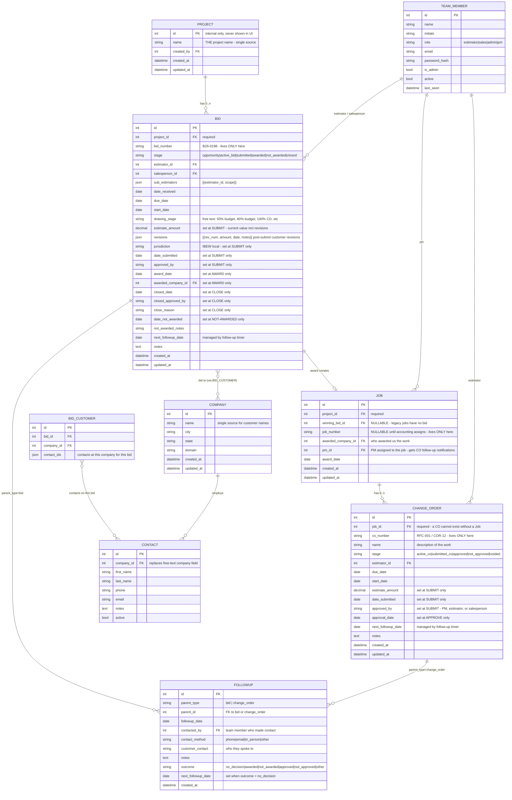
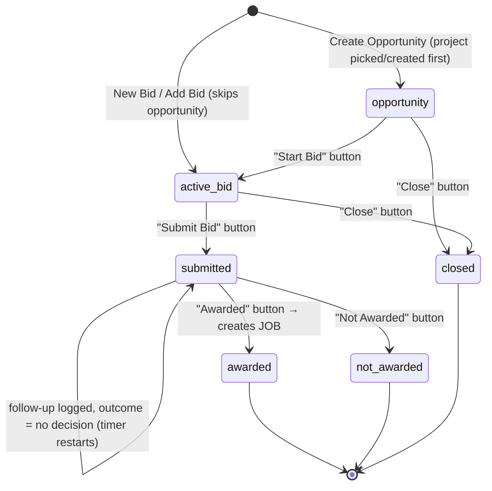
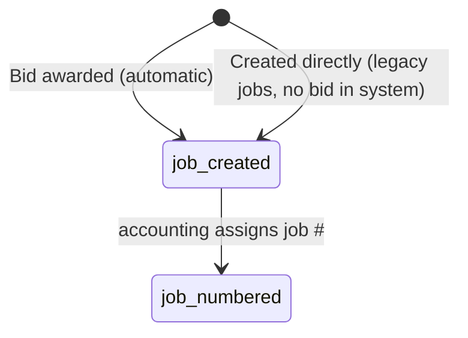
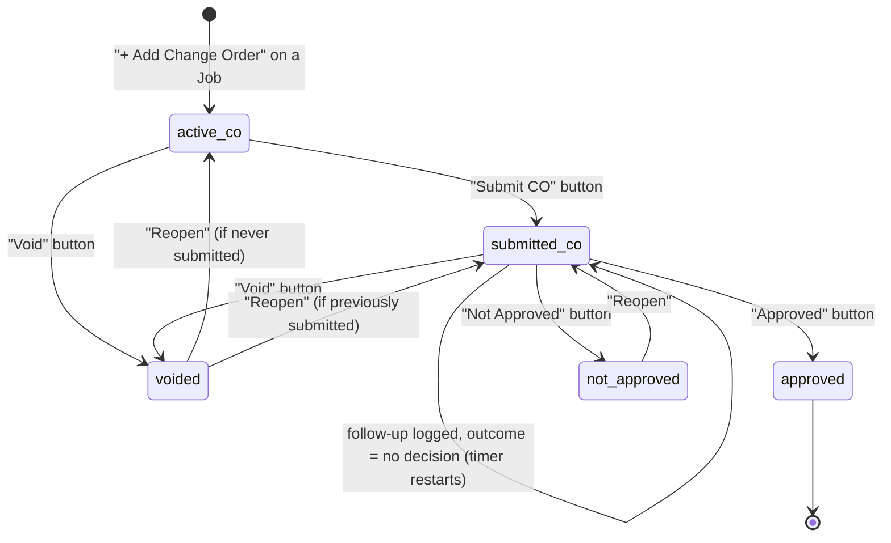

# LIS Estimating Calendar v2 — Gold-Standard Data Model Specification

**Status:** DRAFT v2 — open questions resolved June 12, 2026 (see §7); awaiting full-team sign-off
**Author:** Joe Monchek + Claude
**Date:** June 12, 2026
**Purpose:** Define the correct database structure and application workflow before any further development. Once approved by the team, this document is the single source of truth. Implementation either migrates the current app to this model or rebuilds fresh against it — but the model itself does not change without re-approval here.

---

## 0. Design Principles

1. **Every datapoint lives in exactly ONE place.** No field is ever stored on two entities. (The current system stores job # on Bids, Projects, *and* CO-bids — this is the root cause of the linking mess.)
2. **Entities are separated by what they ARE, not by what screen shows them.** Bids and Change Orders are different things with different lifecycles — they get different tables.
3. **Fields appear only when the lifecycle says they exist.** An active bid has no job #, no estimate $, no award date — those fields literally cannot be filled in until the stage that creates them.
4. **All relationships use internal IDs (foreign keys), never strings.** Linking by matching text (job number strings, customer names) is forbidden.
5. **State transitions are controlled.** Stage changes only happen through explicit action buttons that collect the required fields for that transition (the state machine pattern already proven in the current app).

---

## 1. Entity Relationship Diagram

**Supporting entities carried over unchanged:** `Settings` (global follow-up timers), `Counter` (ID sequences), `Idea` (ideas/issues inbox), `IgnoredPair` (duplicate review), session store.

**Reminders:** become a small polymorphic entity like Followup (`parent_type` + `parent_id`) instead of a sub-document array on Bid, so reminders can attach to Bids, Jobs, or COs.

### Field-Placement Rules (the one-place-only table)

| Datapoint | Lives ONLY on | Everyone else gets it via |
|---|---|---|
| Project name | `Project.name` | join through `project_id` |
| Bid # (B26-XXXX) | `Bid.bid_number` | — |
| Job # | `Job.job_number` | join through `job_id` / `winning_bid_id` |
| RFC/CO # | `ChangeOrder.co_number` | — |
| Customer name | `Company.name` | join through `BID_CUSTOMER` / `awarded_company_id` |
| Contact info | `Contact` | join through `company_id` / `contact_ids` |
| Estimate $ | `Bid.estimate_amount` / `ChangeOrder.estimate_amount` | — |
| Follow-up timers | `Settings` | global config |

> **There is no "bid name."** The bid displays its project's name. The current `Bid.project_name` field (confusingly the "Bid Name") is eliminated. Where the current system used bid-name prefixes like "RFC-20 Bulletin 16 — Fire Alarm", that information now lives properly on `ChangeOrder.co_number` + `ChangeOrder.name`.

---

## 2. State Machines

### 2.1 Bid Lifecycle

**Two ways a Bid is born:** (a) as an `opportunity` first, then promoted via Start Bid; or (b) **created directly at `active_bid`**, skipping the opportunity stage — for when we already know we're bidding. Both paths require the same Start Bid inputs and both assign the bid #. Direct creation is used for a brand-new project, an existing project (a re-bid at a new drawing stage), or any time the internal-discussion opportunity step isn't needed.

| Transition | Button | Required inputs | System actions |
|---|---|---|---|
| → `opportunity` | Create Opportunity | Project (pick existing or create new) | Bid created with FK to project. Most opportunities immediately advance, but some stay here for internal discussion and never become bids. |
| → `active_bid` (direct) | **+ New Bid** (choose new vs existing project) or **+ Add Bid to Project** | Project (new or existing) + all Start Bid inputs below (including the manually-entered bid #) | Creates the bid straight at `active_bid` with the entered bid # — bypasses the opportunity stage. The "+ Add Bid to Project" button on a project is how each drawing-stage re-bid (50% budget → 70% → 100% CD) gets its own B#### under the same project. |
| `opportunity` → `active_bid` | Start Bid | **Bid # (entered manually)**, customer company(ies), customer contact(s), estimator, salesperson, date received, due date. Optional: sub-estimators with scope (data, fire alarm, lighting, lighting controls, etc.), start date, drawing stage (free text: "50% budget", "80% budget", "100% CD"…) | **Bid # is typed in for now** (generated outside this system); auto-generation is a future goal. **Bid #s exist only from this point — opportunities have no bid #.** |
| `active_bid` → `submitted` | Submit Bid | Estimate amount $, IBEW local jurisdiction, date estimate sent, estimate approved by | Follow-up timer starts: `next_followup_date = date_submitted + Settings.fu_initial_days`. Salesperson notified (email + webapp). |
| `submitted` (stays) | Add Revision | Revised amount $, revision date, notes (what the customer requested) | Appends to `revisions[]`; `estimate_amount` updates to the new value. For customer-requested changes after submission that aren't a full re-bid. Each pricing round that IS a full re-bid gets its own new Bid under the same Project. |
| `submitted` → `submitted` | Log Follow-up (outcome: no decision) | Who was contacted, contact method (phone/email/in person), notes | Timer restarts: `next_followup_date = today + Settings.fu_recurring_days`. |
| `submitted` → `awarded` | Awarded | Winning customer (picker shown ONLY if bid went to multiple companies; auto-selected if one), award date (autofilled today, editable) | **Job record created** (`project_id`, `winning_bid_id`, `awarded_company_id`, `award_date`, `job_number = null`). All-user award email sent. |
| `submitted` → `not_awarded` | Not Awarded | Date notified (autofilled today, editable), customer feedback notes (optional) | Final state. |
| `opportunity`/`active_bid` → `closed` | Close | Closure date, approved by, reason | Final state. For opportunities we decided not to bid, or bids we stopped mid-estimate. |

**Fields that DO NOT EXIST on the bid form during `opportunity`/`active_bid`:** job #, estimate $, jurisdiction, date estimate sent, estimate approved by, next follow-up date, bid result, award date, awarded contractor. They are collected by the transition modals, never by the edit form.

**Post-submission price changes — two distinct paths:**
1. **Data-entry error fix (admin-only):** admins can directly edit **all four fields captured at submission** — estimate amount $, IBEW jurisdiction, date estimate sent, and estimate approved by — via an "Edit Submission" action available only while the bid is `submitted`. (The endpoint enforces admin via the logged-in user's `is_admin` flag.)
2. **Customer-requested revision** (not a full re-bid): the "Add Revision" action logs the revision (amount, date, notes) to `revisions[]` and updates the current amount — any user involved with the bid can do this. Full re-prices at a new drawing stage are a **new Bid** under the same Project.

### 2.2 Job Lifecycle

- A Job is born when a bid is awarded — **or created manually at any time** for legacy work bid before this system existed. Manual Job creation is a permanent feature, not a migration-only tool, so legacy jobs can be added after launch as they come up. Legacy jobs have `winning_bid_id = null`.
- `job_number` is **nullable by design**: accounting assigns it after the contract arrives, sometimes days or weeks after award. The UI shows "Job # pending" until set.
- **`pm_id`** — the PM assigned to the job. Set at/after award (or at manual creation). The Job's PM receives CO follow-up notifications (§2.3).
- Change orders attach to Jobs regardless of whether a job # exists yet (they FK to `job_id`, the internal ID, not the number).

### 2.3 Change Order Lifecycle

| Transition | Button | Required inputs | System actions |
|---|---|---|---|
| → `active_co` | + Add Change Order (from Job view) | RFC/CO #, name (description of work), due date, start date. Optional: estimator | Cannot be created without a parent Job. |
| `active_co` → `submitted_co` | Submit CO | Estimate amount $, date submitted, approved by (free pick — can be a PM, estimator, or salesperson) | Follow-up timer starts; **the Job's PM** (`Job.pm_id`) notified (email + webapp). |
| `submitted_co` → `submitted_co` | Log Follow-up (no decision) | Who contacted, method, notes | Timer restarts per Settings. |
| `submitted_co` → `approved` | Approved | Approval date (autofilled today, editable) | CO joins the Job's approved-CO list. |
| `submitted_co` → `not_approved` | Not Approved | Date notified, notes (optional) | Reopenable (below). |
| any active state → `voided` | Void | Reason | **Any user** can void. Customer canceled the RFC / work not proceeding. |
| `voided`/`not_approved` → reopen | Reopen | — | **Any user** can reopen. Returns to `submitted_co` if it had been submitted, otherwise `active_co`. Follow-up timer restarts on reopen to `submitted_co`. |

**Terminology note:** RFC (request for change), COR (change order request), and CO (change order) are all the same entity. The `co_number` field stores whatever prefix the customer's system uses (RFC-20, COR-3, CO-7).

---

## 3. Field Inventory per Entity and Stage

### 3.1 Bid — field availability by stage

| Field | opportunity | active_bid | submitted | awarded | not_awarded | closed |
|---|---|---|---|---|---|---|
| project_id | ●R | ●R | ● | ● | ● | ● |
| bid_number | — | ●R manual | ● | ● | ● | ● |
| customers (companies) | ○ | ●R | ● | ● | ● | ● |
| customer contacts | ○ | ●R | ● | ● | ● | ● |
| estimator_id | ○ | ●R | ● | ● | ● | ● |
| sub_estimators | — | ○ | ○ | ○ | ○ | ○ |
| salesperson_id | ○ | ●R | ● | ● | ● | ● |
| date_received | ○ | ●R | ● | ● | ● | ● |
| due_date | ○ | ●R | ● | ● | ● | ● |
| start_date | — | ○ | ○ | ○ | ○ | ○ |
| drawing_stage | — | ○ | ○ | ○ | ○ | ○ |
| notes | ○ | ○ | ○ | ○ | ○ | ○ |
| estimate_amount | ✕ | ✕ | ●R (set at submit; admin Edit Submission after) | ● | ● | ✕ |
| revisions[] | ✕ | ✕ | ○ (Add Revision action) | ● | ● | ✕ |
| jurisdiction | ✕ | ✕ | ●R (set at submit; admin Edit Submission after) | ● | ● | ✕ |
| date_submitted | ✕ | ✕ | ●R (set at submit; admin Edit Submission after) | ● | ● | ✕ |
| approved_by | ✕ | ✕ | ●R (set at submit; admin Edit Submission after) | ● | ● | ✕ |
| next_followup_date | ✕ | ✕ | ● system-managed | ✕ | ✕ | ✕ |
| award_date | ✕ | ✕ | ✕ | ●R (set at award) | ✕ | ✕ |
| awarded_company_id | ✕ | ✕ | ✕ | ●R (set at award) | ✕ | ✕ |
| date_not_awarded / notes | ✕ | ✕ | ✕ | ✕ | ●R | ✕ |
| closed_date / approved_by / reason | ✕ | ✕ | ✕ | ✕ | ✕ | ●R |

Legend: **●R** required · **●** present (read-only or editable per role) · **○** optional · **—** not yet collected · **✕** must not exist/display at this stage

### 3.2 Change Order — field availability by stage

| Field | active_co | submitted_co | approved | not_approved | voided |
|---|---|---|---|---|---|
| job_id | ●R | ● | ● | ● | ● |
| co_number | ●R | ● | ● | ● | ● |
| name (work description) | ●R | ● | ● | ● | ● |
| due_date | ●R | ● | ● | ● | ● |
| start_date | ●R | ● | ● | ● | ● |
| estimator_id | ○ | ○ | ○ | ○ | ○ |
| estimate_amount | ✕ | ●R (set at submit) | ● | ● | ✕ |
| date_submitted | ✕ | ●R (set at submit) | ● | ● | ✕ |
| approved_by | ✕ | ●R (set at submit) | ● | ● | ✕ |
| next_followup_date | ✕ | ● system-managed | ✕ | ✕ | ✕ |
| approval_date | ✕ | ✕ | ●R | ✕ | ✕ |

---

## 4. Cross-Comparison: Current State vs Target

### 4.1 Structural breaks (cannot be patched in place)

| # | Current state | Problem | Target |
|---|---|---|---|
| 1 | `job_number` exists on **Bid**, **Project**, and CO-bids | Same datapoint in 3 places; linking requires string-matching; cleanup tools exist solely to reconcile them | Job # lives ONLY on the new `Job` entity |
| 2 | **Change orders are rows in the `bids` collection** (flagged by `stage='active_co'` and/or `co_number`) | COs inherit 40+ bid fields that don't apply; frontend needs `isCO` heuristics everywhere (this caused 3 bugs in the last week alone) | Separate `ChangeOrder` collection with FK to Job |
| 3 | Customers are **free-text strings ×5** (`customer`, `customer2`…`customer5`) | Typos create phantom companies; analytics by customer are fuzzy; the 527-bid missing-customer cleanup problem is a direct symptom | `Company` entity + `BID_CUSTOMER` join table |
| 4 | `Bid.project_name` ("Bid Name") is a **copy** of project info | Two names for the same thing drift apart; required-field validation on it has broken saves repeatedly | Eliminated — bid displays `Project.name` via join |
| 5 | `Contact.company` is free text | Cannot reliably link contacts to the companies we bid to | `Contact.company_id` FK to Company |
| 6 | `stage` + `status` are **redundant** (`status:'Awarded'` duplicates `stage:'awarded'`) | Two fields must be kept in sync manually; the "null stage" bug came from exactly this class of problem | Single `stage` field; `status` eliminated |
| 7 | No `submitted` stage — current `follow_up` stage conflates "submitted, awaiting decision" with the follow-up activity | Awkward stage naming; submission data (`date_estimate_sent`) can exist on non-submitted bids | Explicit `submitted` stage entered only via Submit button |
| 8 | `phases` sub-document on Bid (50% Budget, 80% DD, CD Pricing…) | Phases are snapshots of bid fields — more duplicated data | **Resolved (Q4):** each pricing round is a separate Bid under the same Project, with a `drawing_stage` free-text field ("50% budget", "80% budget", "100% CD"…). Post-submission customer tweaks use `revisions[]` instead of a new bid (Q5) |
| 9 | `reminders` sub-document array on Bid | Can't attach reminders to Jobs or COs | Polymorphic `Reminder` entity |
| 10 | `parent_bid_id` links CO-bids to awarded bids, but `getLinkedCOs` ALSO matches by job_number string | Dual-path linking caused the bid-shows-as-its-own-CO bug | Single FK: `ChangeOrder.job_id` |

### 4.2 Compatible as-is (carry over unchanged)

| Entity / system | Notes |
|---|---|
| `TeamMember` | Auth, roles, is_admin, last_seen presence — all fine. Consider adding `pm` role for CO follow-ups. |
| `Settings` | `fu_initial_days` / `fu_recurring_days` already match the described timer design exactly. |
| `Counter` | ID sequence generator — reused for all new entities. |
| `Idea`, `IgnoredPair` | Unchanged. |
| `Followup` | Current schema is ~90% right (who/method/notes/next-date already exist). Add `parent_type` + rename `bid_id` → `parent_id`; add `outcome` enum. |
| Sessions / bcrypt auth / express-session | Unchanged. |
| Email infrastructure (`mailer.js`, cron digest) | Templates reference bid fields — rework field mapping only. |

### 4.3 Verdict: migrate in place vs rebuild

**Recommendation: rebuild the data layer; port the frontend page-by-page; keep the same stack and repo.**

Reasons:
- Items 1–7 above touch **every query in db.js, every form in index.html, and most of the 6,000-line app.js**. "Migrating in place" would mean changing nearly every file anyway — but while live users depend on it, with bad data feeding back in through the old paths.
- The 2026-only data cutoff means the real-data migration is a **bounded, one-time import script**, not an in-place mutation of the live database. That's far safer.
- A fresh MongoDB database (new collections, same Atlas cluster) + import script + fake-dataset test phase gives a clean cutover with a rollback path (old app keeps running until the new one is approved).
- What does NOT need rebuilding: auth, team, settings, email, presence, ideas, TV kiosk scaffolding, the visual design/CSS, and the state-machine button pattern — all carry over.

Realistically this is a **new version of the app sharing ~40% of its code**, not a patch.

---

## 5. Feature Preservation Inventory

Features built in v1, mapped onto the new model:

| Feature | Carries over? | Notes |
|---|---|---|
| State-machine stage buttons + transition modals | ✅ Pattern reused directly | Extended with Submit/Close/Void modals per §2 |
| Follow-up timers + salesperson notification | ✅ | Now also applies to COs; same Settings values |
| Email notifications (assignment, follow-up, awarded, reminders) | ✅ | Re-point field mappings; awarded email gains winning-company name |
| Weekly digest (web + email, Monday 6AM cron) | ✅ | Sections re-derive from new entities; overdue follow-ups stay at bottom |
| Dashboard (calendar, upcoming estimates w/ red-yellow-green, My View toggle) | ✅ | Queries re-pointed |
| Projects page (bid counts, pipeline value, estimator pills) | ✅ improved | Hierarchy view becomes natural: Project → Bids → Job → COs is now the actual data shape, not a heuristic |
| Project panel hierarchy (awarded bold, COs nested) | ✅ improved | No more isCO guessing |
| Bid flyout (details, contacts, reminders, lifecycle, View Project →) | ✅ | Lifecycle section reads Job + ChangeOrders directly |
| Global search | ✅ | Searches Projects, Bids, Jobs, COs, Companies, Contacts |
| Contact/company profile modals + bid history | ✅ improved | Real Company entity makes per-customer stats exact |
| Estimator profiles + stats | ✅ | |
| IBEW jurisdiction picker | ✅ | Moves into the Submit Bid modal (it's a submission-time field) |
| Sub-estimators with scope | ✅ | Unchanged shape |
| Reminders | ✅ reworked | Polymorphic entity per §4.1 item 9 |
| Submit bid modal | ✅ | Becomes THE place estimate $/jurisdiction/sent-date/approved-by are entered |
| Admin password-confirm for destructive actions | ✅ | Pattern reused |
| Online presence (sidebar dot, heartbeat) | ✅ | Unchanged |
| Ideas/issues inbox | ✅ | Unchanged |
| TV kiosk view | ✅ | Queries re-pointed |
| Excel sync (`sync-excel-lib.js`) | ⚠️ Replaced | Becomes the one-time 2026 import script (§6). Ongoing Excel sync is retired — the app IS the system of record in v2. |
| Project auto-grouping / duplicate review | ⚠️ Migration-only | Used during import; not needed at runtime since bids are born with a project FK |
| Data Cleanup page (issue chips, RFC/COR cleanup, customer propagation, job-number scan, bulk link) | ❌ Obsolete by design | These tools exist to reconcile the duplicated datapoints v2 eliminates. The "Awarded No Job #" view survives as a normal filter (jobs awaiting accounting's job #). |
| Admin stage override | ⚠️ Keep, rarely needed | Still useful for correcting mistakes, but bad-stage data shouldn't occur in v2 |
| Admin-only project rename (✏️ pencil) | ✅ | Confirmed (Q1) — many projects were misnamed in the original Excel; rename stays admin-only |
| Bid "phases" (50% Budget, 80% DD…) | ✅ Replaced | Resolved (Q4): re-bid-under-same-project + `drawing_stage` text field per bid; `revisions[]` for post-submit customer tweaks |

---

## 6. Data Migration Strategy

### 6.1 Scope filter (per team decision)

Import from the current database ONLY records matching:
- `bid_number` starts with `B26`, **OR**
- any of `start_date` / `date_submitted (date_estimate_sent)` / `due_date (estimate_due_date)` falls in 2026

Everything else stays in the old database (kept read-only for historical reference) — it is NOT deleted, just not migrated. **Future phase (per Q10):** pre-2026 history will eventually be imported in *summarized* form (e.g., per-customer/per-year win-loss totals) for long-term analytics, after v2 is stable.

### 6.2 Derivation rules (old → new)

| Old record shape | Becomes |
|---|---|
| Bid with `stage ∉ {active_co}` and no `co_number` | **Bid** row. Stage mapping: `opportunity→opportunity`, `active_bid→active_bid`, `follow_up→submitted`, `awarded→awarded`, `not_awarded→not_awarded`, `closed→closed` |
| Bid with `stage='active_co'` or `co_number` set | **ChangeOrder** row, attached to the Job matching its job_number string (manual review queue for unmatched) |
| Awarded bid | Bid row + minted **Job** (`winning_bid_id` set, `job_number` from old bid/project, `awarded_company_id` from customer string match) |
| Known legacy jobs (full list, per Q8): AMY James Martin, William H Gray 30th Street Station, Bridesburg Recreation Center, CHOP Fuel Oil, Dillworth Plaza, Friend's Center 3rd Floor Renovations, Temple Infusion, UPenn Vlest Shoji Hall Lab Fitout | **Job** rows created manually with `winning_bid_id = null`. Manual Job creation is a permanent feature — more legacy jobs can be added any time after launch |
| Distinct customer strings across `customer`–`customer5` + `Contact.company` | **Company** rows after normalization (trim, case-fold, collapse punctuation). Fuzzy near-matches (e.g. "Torcon" vs "Torcon Inc.") go to a manual merge-review list — the IgnoredPair review UI pattern is reused for this |
| `Bid.customer`–`customer5` values | **BID_CUSTOMER** join rows pointing at the deduped Company |
| `customer_contacts` sub-docs | Contact links on the matching BID_CUSTOMER row |
| `Followup` rows | Same rows + `parent_type='bid'` |
| `reminders` sub-docs | **Reminder** rows |

Import script properties: **idempotent** (re-runnable), **dry-run mode** (prints what it would create, writes nothing), and emits an **exceptions report** (unmatched COs, ambiguous companies, bids missing required fields) for manual resolution rather than guessing.

### 6.3 Fake dataset for pre-rollout testing

A seed script generates a realistic test database exercising **every lifecycle path** before real data is imported:

| # | Scenario |
|---|---|
| 1 | Project with one opportunity, never advanced (internal discussion only) |
| 2 | Opportunity closed without bidding (closure date/approver/reason) |
| 3 | Active bid closed mid-estimate |
| 4 | Bid submitted, multiple follow-ups logged with "no decision" (timer restarts visible) |
| 5 | Bid submitted to **3 companies**, awarded to one (winner picker exercised) |
| 6 | Awarded bid whose Job has **no job # yet** (accounting pending) |
| 7 | Awarded bid → Job → 3 COs: one approved, one not approved, one voided |
| 8 | **Legacy Job** (no bid in system) with active + approved COs |
| 9 | Project with a budget-only bid AND a separate awarded bid (the re-bid pattern) |
| 10 | Bid not awarded, with customer feedback notes |
| 11 | Companies with multiple contacts; one contact on two different bids |
| 12 | Overdue follow-ups on both a bid and a CO (notification + digest testing) |

### 6.4 Cutover sequence

1. Build v2 against the **fake dataset** until the team signs off on every workflow
2. Run the import script in dry-run against a copy of production; resolve the exceptions report
3. Real import into the v2 database; old app and DB remain untouched and running
4. Team parallel-tests v2 with real data for an agreed window
5. Flip: v2 becomes the live URL; v1 kept read-only for historical lookups

---

## 7. Resolved Decisions (answered by JM, June 12, 2026)

All questions from the initial draft are resolved and folded into §1–§6 above. Recorded here for the audit trail:

| # | Question | Decision | Folded into |
|---|---|---|---|
| Q1 | Project rename after a Job exists? | **Yes, admin-only** — many projects were misnamed in the original Excel file | §5 feature inventory |
| Q2 | Who can void a CO; reopenable? | **Anyone** can void; voided and not-approved COs **can be reopened** (back to `submitted_co` if previously submitted, else `active_co`) | §2.3 state machine |
| Q3 | Submit CO fields | **CO estimate $, date submitted, approved by** (approver can be a PM, estimator, or salesperson). No jurisdiction on COs | §2.3, §3.2 |
| Q4 | What replaces phases | **Each pricing round = separate Bid under the same Project**, with a free-text `drawing_stage` field per bid ("50% budget", "80% budget", "100% CD"…) | §1 ERD, §2.1, §3.1, §4.1 #8 |
| Q5 | Edit estimate $ after submission | **Admin-only direct edit** for data-entry errors. Customer-requested changes that aren't a full re-bid use the **Add Revision** action (`revisions[]`: amount, date, notes) which updates the current amount | §1 ERD, §2.1, §3.1 |
| Q6 | Who gets CO follow-up notifications | **The PM assigned to the Job** — `Job.pm_id` added | §1 ERD, §2.2, §2.3 |
| Q7 | Split awards | **No — exactly one winner** per bid | §2.1 (as designed) |
| Q8 | Legacy job list | AMY James Martin, William H Gray 30th Street Station, Bridesburg Recreation Center, CHOP Fuel Oil, Dillworth Plaza, Friend's Center 3rd Floor Renovations, Temple Infusion, UPenn Vlest Shoji Hall Lab Fitout. Manual Job creation is a **permanent feature** — more can be added after launch | §2.2, §6.2 |
| Q9 | When is bid # assigned | **Only at `active_bid`** — opportunities have no bid # | §2.1 |
| Q10 | Pre-2026 history | Old app/DB kept read-only; **summarized history imported eventually** in a future phase | §6.1 |

---

*All decisions resolved. Next step: full-team review and sign-off, then implementation begins per §6.4 — fake data first, real data only after sign-off.*
